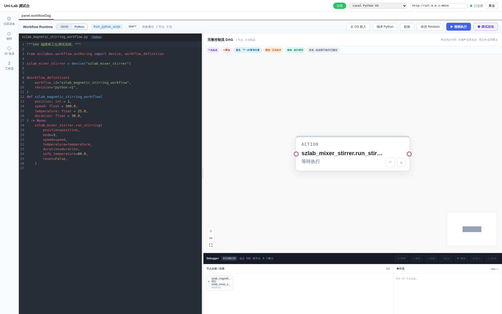
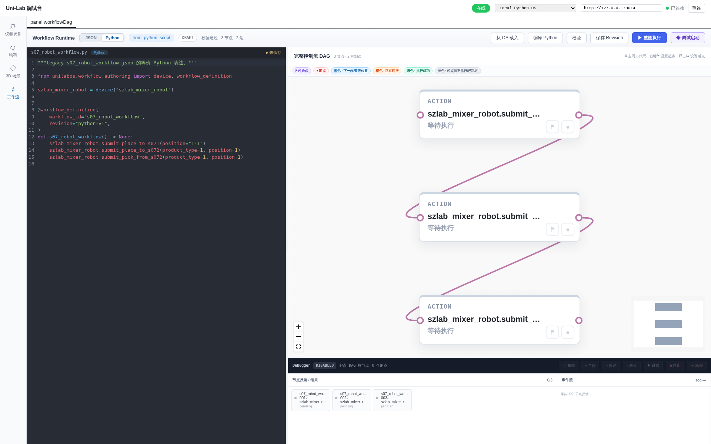
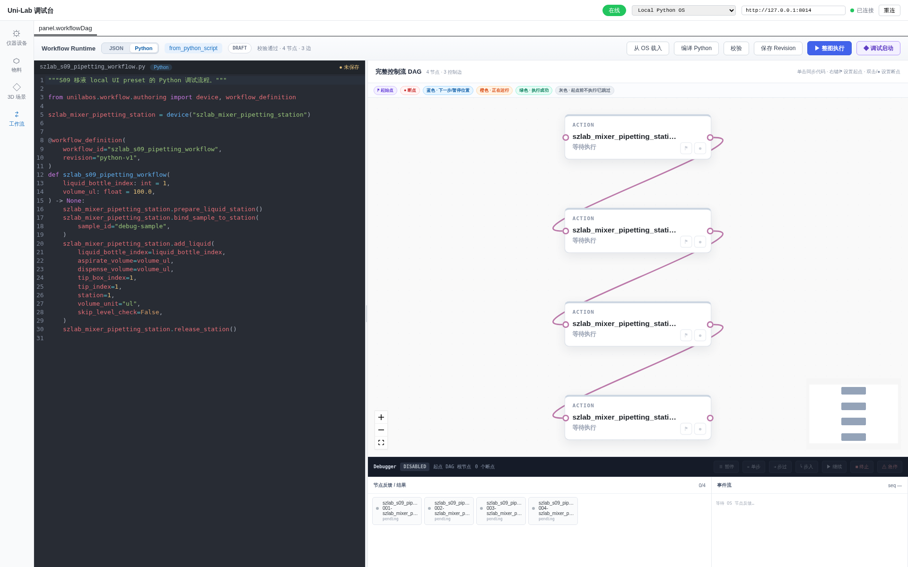
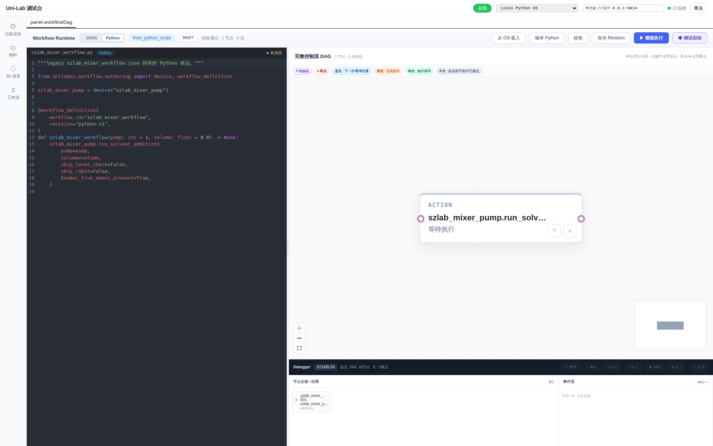

# 全部生产工作流 E2E 截图

总计 12 个 SZLab 生产 Python 工作流。每个工作流都经过：

1. Python 源码直接提交 `/api/v1/authoring/compile`；
2. 最新 `uni-lab-fe` Python 编辑器重新载入源码；
3. 点击“编译 Python”；
4. 点击“校验”并通过 `/api/v1/workflows:validate`；
5. 核对真实节点数与控制边数后截取代码和完整 DAG。

机器可读结果见
[`screenshots/all-workflows-e2e-result.json`](screenshots/all-workflows-e2e-result.json)。

## SZLab

### 1. S04 磁搅单工位

`szlab_magnetic_stirring_workflow`：1 节点、0 边。



### 2. S05 拍照检测

`szlab_photoshotting_workflow`：1 节点、0 边。


### 3. 机械臂 S04 取放

`szlab_robot_action_workflow`：2 节点、1 边。


### 4. S04 机械臂—磁搅

`s04_robot_stirring_workflow`：3 节点、2 边。


### 5. S06 机械臂—加液

`s06_robot_workflow`：3 节点、2 边。


### 6. S07 机械臂搬运

`s07_robot_workflow`：3 节点、2 边。



### 7. S07 固体投料

`szlab_s07_solid_addition_workflow`：3 节点、2 边。


### 8. S08 开关盖

`s08_cap_workflow`：2 节点、1 边。


### 9. S09 移液

`szlab_s09_pipetting_workflow`：4 节点、3 边。



### 10. 堆栈状态—S05—S06

`szlab_stack_s05_s06_workflow`：3 节点、2 边。


### 11. Mixer 加液兼容流程

`szlab_mixer_workflow`：1 节点、0 边。



### 12. Mixer Pump 生产流程

`szlab_mixer_pump_production`：1 节点、0 边。


## 复现

启动 SZLab 本地 bridge 与最新前端后运行：

```bash
./scripts/capture-all-workflows-e2e.sh
```

脚本自动发现 `szlab_poly_studio/workflows/` 下除 `__init__.py` 外的生产源码；数量不是 12、任一编译或
校验失败、节点数不一致、出现未预期的 HTTP/浏览器错误时都会失败。
