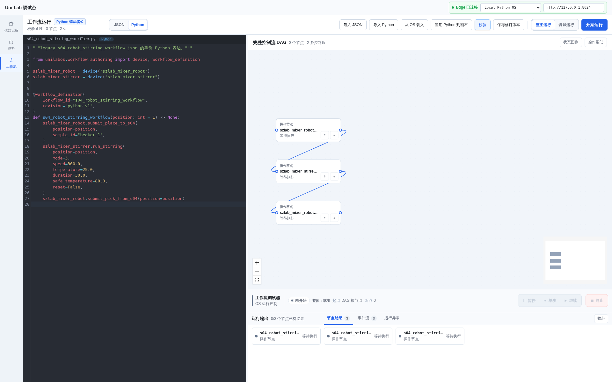
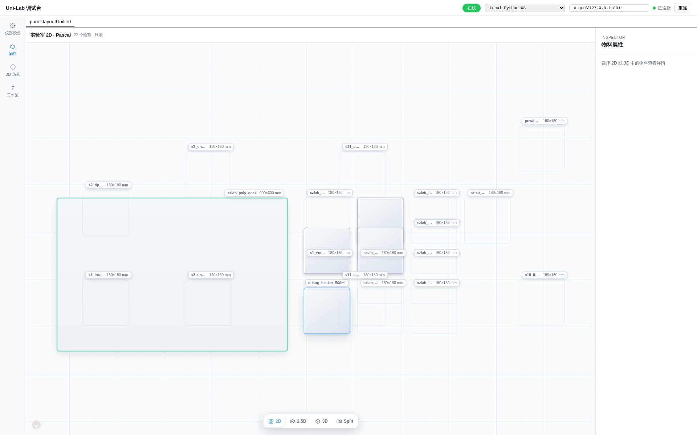
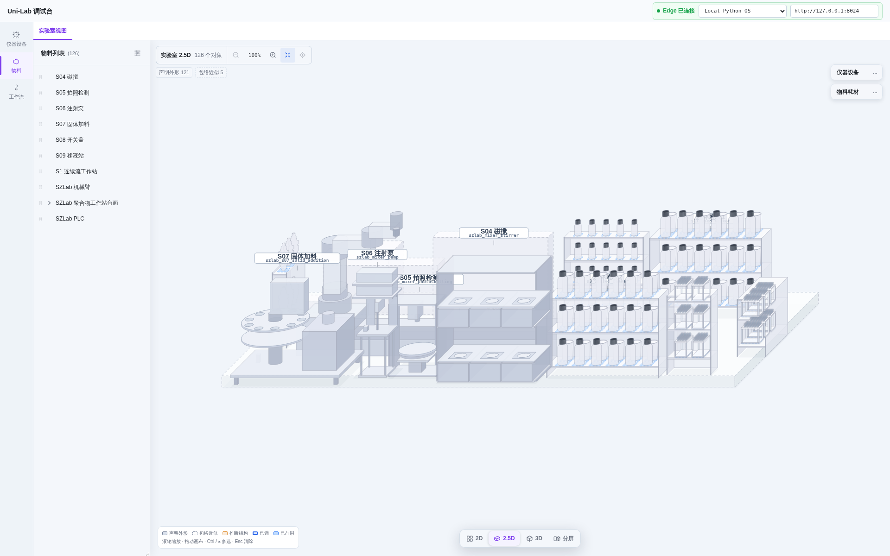
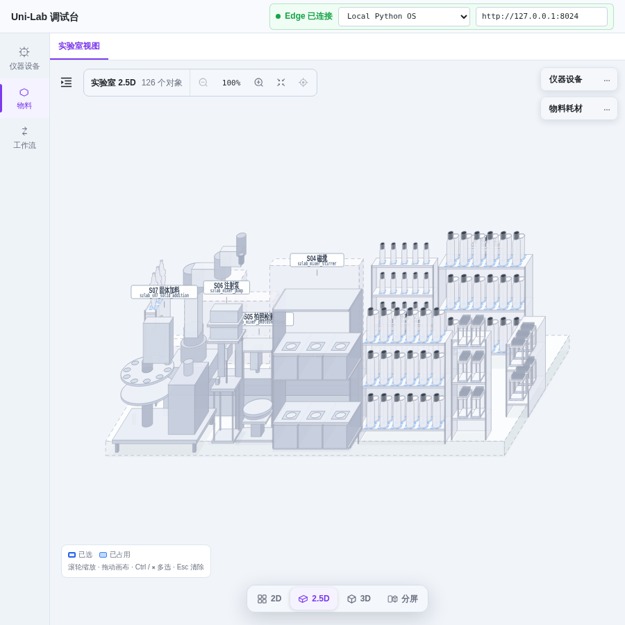

# SZLab 最新前端 E2E 截图

本页聚焦 SZLab 物料视图和一个代表性工作流。全部 12 个生产工作流截图见
[`ALL_WORKFLOW_SCREENSHOTS.md`](ALL_WORKFLOW_SCREENSHOTS.md)。

截图由 `uni-lab-fe@2d77758`、SZLab 独立 Profile、
`deployment/graphs/szlab-local-debug.json` 和 OfflineOS bridge 共同生成。浏览器视口为
1920×1200。

## Python 代码与节点画布

S04 机械臂—磁搅流程通过真实 `/api/v1/authoring/compile` 和
`/api/v1/workflows:validate` 接口，画布断言为 3 个节点、2 条控制边。



## 2D 物料界面

2D 投影从 `/api/v1/materials` 分两页加载 126 个 SZLab 聚合对象，不包含 AI4C 设备。



## 2.5D 物料界面

2.5D SVG 投影使用同一份 126 对象 Material Aggregate。Bridge 从由装饰器绑定、分布在各
`models/shape.yml` 中的 14 条 SZLab 外形声明生成 `/api/v1/material-shapes`。除工站设备外，
试剂瓶、样品瓶与烧杯也使用设备包自带的可辨识轮廓。E2E 会断言 S04 磁搅节点使用
`stirrer_rack`、试剂瓶使用 `capped_reagent_bottle`，并验证 2.5D 缩放和适应全部控制。



900×900 窄屏回归会先收起物料列表，确认画布控制、可信度状态、选中详情与底部视图切换
均保持可用。



## 复现

先分别启动 SZLab bridge 与最新前端：

```bash
UNILAB_PYTHON=/home/changjunhan/.micromamba/envs/unilab/bin/python \
  ./scripts/start-authoring-bridge.sh

cd ../uni-lab-fe
pnpm --filter @unilab/kernel-web preview --host 127.0.0.1 --port 4173
```

再从本仓库运行：

```bash
bash ./scripts/capture-szlab-e2e.sh
```

机器可读结果保存在
[`screenshots/szlab-e2e-result.json`](screenshots/szlab-e2e-result.json)。
E2E 请求中的工作流编译、编写校验、Canonical 校验、分页 Material API 和外形接口均为
200，未出现未预期的浏览器错误。离线 bridge 不代理 Registry 的 resource-template 目录，
对应 503 会单独记录为兼容性警告，不参与只读物料图的通过判定。
