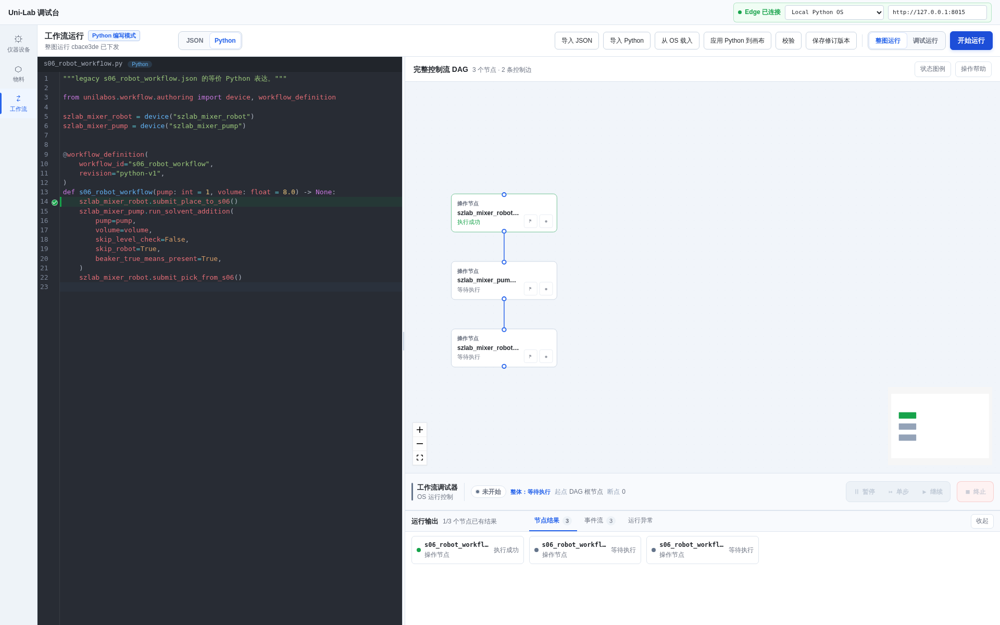
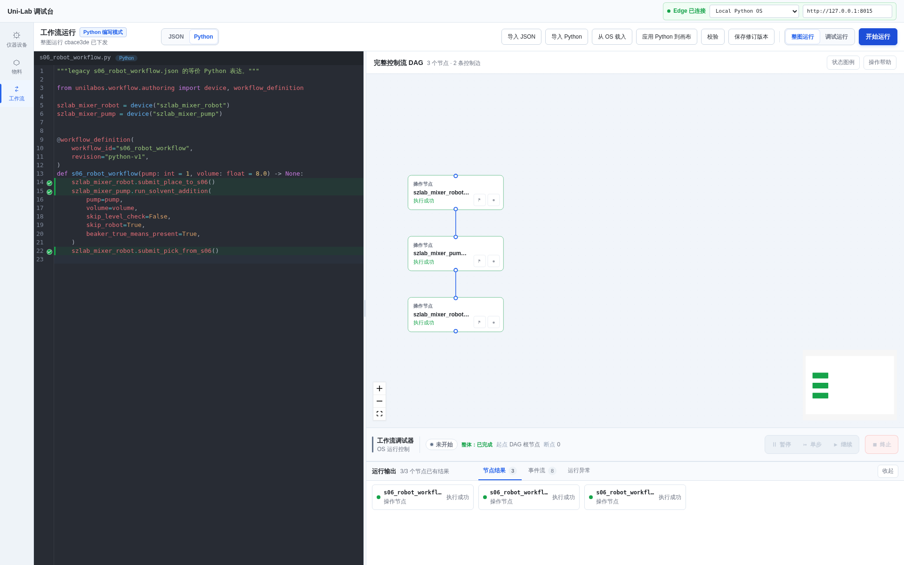
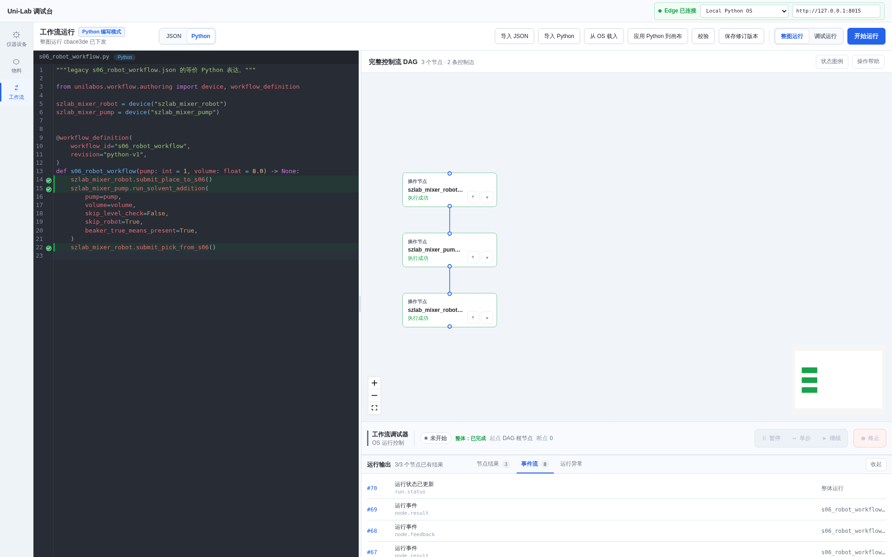

# S06 Robot 工作流真实 OPC UA 联调结果

## 结论

- 运行时间：2026-07-30 18:45（Asia/Shanghai）
- 工作流：`s06_robot_workflow`
- Run ID：`cbace3de8a584aab82c39c952c449179`
- OPC UA：`opc.tcp://opcua.ideawit.com:4855/xuse_sim`
- 工作流结构：3 节点、2 条控制边
- 最终状态：`completed`
- 节点结果：3/3 `success`
- 前端 API：30 次请求，HTTP 失败 0
- 浏览器错误：0

## 运行过程

| 时间 | 动作 | 握手结果 |
| --- | --- | --- |
| 18:45:16 | `submit_place_to_s06`，任务号 11 | accepted |
| 18:45:20 | S06 放料完成 | 烧杯传感器置 True，完成码 11 |
| 18:45:25 | 任务 11 复位 | 写入完成 False、任务号 0、完成码 0 |
| 18:45:32 | `run_solvent_addition`，工艺 1 | accepted |
| 18:45:33 | 泵 1 加液完成 | `S06_1号溶液添加量=8`，加工完成 True |
| 18:45:35 | S06 加液复位 | 工艺号 0、参数写入完成 False、加工完成 False |
| 18:45:41 | `submit_pick_from_s06`，任务号 12 | accepted |
| 18:45:45 | S06 取料完成 | 烧杯传感器置 False，完成码 12 |
| 18:45:50 | 任务 12 复位 | 写入完成 False、任务号 0、完成码 0 |

过程截图显示第一个节点成功、其余节点等待：

完成截图显示三个节点全部执行成功：

事件流截图：

## 结果文件

- `screenshots/s06-live-e2e/result-summary.json`：结果摘要
- `screenshots/s06-live-e2e/compiled-workflow.json`：由 `s06_robot.py` 编译出的工作流
- `screenshots/s06-live-e2e/run-created.json`：Run 创建响应
- `screenshots/s06-live-e2e/run-progress.json`：运行中状态、节点和事件
- `screenshots/s06-live-e2e/run-final.json`：最终状态、三个节点返回值和完整事件
- `screenshots/s06-live-e2e/run-timeline.json`：运行时间线投影
- `screenshots/s06-live-e2e/browser-api-calls.json`：前端 API 请求及浏览器错误
- `../runtime/s06-live-e2e/handshake.log`：握手器初始化、accepted/completed/reset 全过程
- `../runtime/s06-live-e2e/capture.log`：自动化采集结果
- `../runtime/ideawit-e2e/logs/ws_comm_2026-07-30 18-41-11.log`：Edge 收发 DAG、逐节点状态和 Run 终态

## 已知显示行为

运行过程截图中，第一节点已经成功时，底部整体状态仍可能短暂显示“等待执行”。
这是 Edge 只在设备反馈/终态时回传节点状态、动作等待 OPC 握手期间没有独立
`running` feedback 导致的显示滞后；本次三个设备终态和整个 Run 终态均已正常收敛。

Edge 启动阶段出现的云端 401 和 PLR Deck 序列化警告没有阻塞本次本地
Bridge/Edge/OPC UA 工作流执行。
