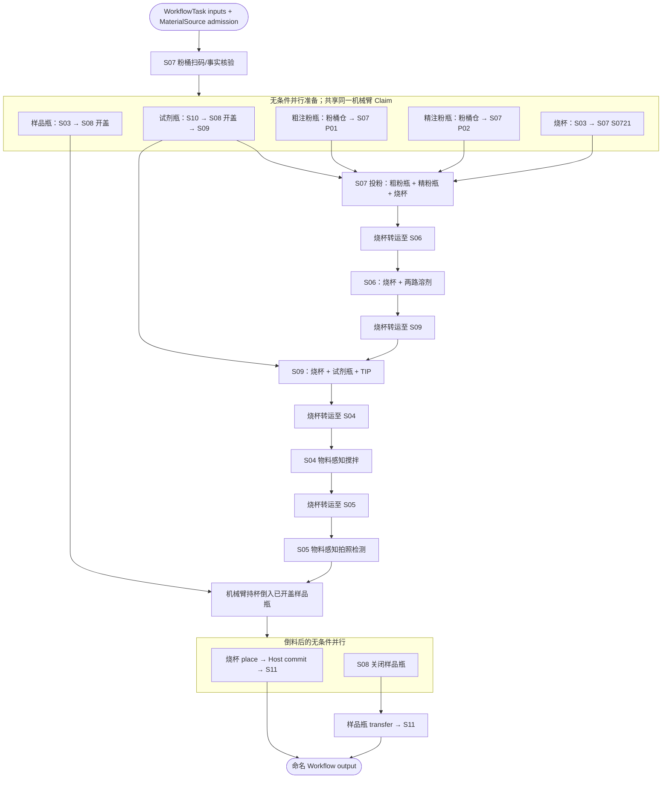

# 单样品 38 动作 JSON 的物料感知改写

状态：2026-08-04 已进入 PackageCatalog 的生产源码。本文对应附件
`ozr3xzczpml1e5chr8ik43mc0-szlab_single_sample_atomic_workflow.json`，目标 Python 源码见
[`single_sample_atomic_material.py`](../szlab_poly_studio/workflows/single_sample_atomic_material.py)；
未规范化前的说明性版本保留在
[`single_sample_atomic_material_target.py`](examples/workflow_authoring/single_sample_atomic_material_target.py)。

这不是把 38 个旧方法逐行换名，而是把“位置型控制序列”重建为有物料身份、有转运提交、有
多物料汇合和命名输出的 Workflow。生产源码和一个通用标准转运子工作流已经登记
`package.yaml`，并通过“先发布子工作流、再发布主工作流”的真实 Authoring 生命周期。
第 6 节仍列出现场机械臂部署必须 fail-closed 验收的 Site/见证项；软件进入生产目录不等于绕过
点位、负载或传感器验收。

## 1. 原文件的输入事实

原文件顶层只有 `name` 和一个 rule：`S10 取试剂瓶 == true` 的 rising edge 触发，随后按
`index=1..38` 执行 action。它记录了工艺顺序，但没有材料节点、材料边、Host 物料归属提交或
真正的条件表达式。

原附件还有两个格式缺陷，重写时按可恢复的业务意图处理：

- 第 10 个 action 重复声明 `node` key；两个值相同，不影响语义恢复。
- 第 24 个 action 后多一个 `}`，所以附件不是严格可解析的 JSON。

另外，第 7-8、11-12 步的注释声称“根据扫码结果决定是否执行”，但 action 数组本身没有条件边；
旧执行器仍会顺序执行它们。新主流程不会继续这种“注释条件”。

## 2. 改写后的材料合同

| 材料 | 新入口 | 主线 | 最终位置/输出 |
|---|---|---|---|
| 500 mL 烧杯 | `MaterialSource(beaker_500ml)` | S03 → S07 → S06 → S09 → S04 → S05 → 倒料 → S11 | `used_beaker` |
| 250 mL 样品瓶 | `MaterialSource(sample_vial_250ml)` | S03 → S08 开盖 → 接收样品 → 关盖 → S11 | `product_vial` |
| 100 mL 液体试剂瓶 | Workflow `ResourceSlot` input | S10 → S08 开盖 → S09 移液 | `reagent_bottle` |
| 粗注粉瓶 | `MaterialSource(powder_container)` | 粉桶仓 → S07 P01 → 投粉 | `coarse_powder_cartridge` |
| 精注粉瓶 | `MaterialSource(powder_container)` | 粉桶仓 → S07 P02 → 投粉 | `fine_powder_cartridge` |
| S09 TIP | Workflow `ResourceSlot` input | S09 取 TIP → 移液 → 放 TIP/更新 disposition | `tip` |
| S06 泵 1 溶剂 | Workflow `ResourceSlot` input | S06 储液位 → 烧杯内容物 | 同名 Action output |
| S06 泵 2 溶剂 | Workflow `ResourceSlot` input | S06 储液位 → 烧杯内容物 | 同名 Action output |

试剂瓶、TIP 和两路 S06 溶剂暂用 Workflow input，是因为当前部署图还没有为这些具体业务物料
发布可供 admission 选择的完整 MaterialSource 库存事实；这仍是完整 `ResourceSlot` 合同，不是
`sample_id` 替代物。它们所在的已知仓库不再重复作为 Workflow input：例如 S10 直接写为
`resource_ref("s10_liquid_reagent")`。

### 2.1 Warehouse 与 Site 的边界

主 Workflow 只暴露业务运行时必须选择的输入。启动图已经唯一确定的 Warehouse 全部在流程内部
用稳定资源 ID 绑定：

```python
source_warehouse = resource_ref("s3_unused_beaker")
powder_warehouse = resource_ref("powder_container_warehouse")
s04_warehouse = resource_ref("s04_process_warehouse")
```

所有 Site（如 `L1B1`、`S0721`、`S061`、`BEAKER1`、`S041`、`S051`、`S081`）都是当前工艺与
启动部署共同确定的内部常量，不作为顶层参数，也不再先定义一组“整体变量”再传递。这样调用者
不能把 S07 的烧杯误送到粉瓶位，也不会把部署配置伪装成每次 Task 的业务输入。

当前启动图尚未发布 S08/S09 的 typed process Warehouse 实例，因此主流程暂时只保留
`s08_warehouse`、`s09_warehouse` 两个 `ResourceSlot` 输入，并继续受第 6 节现场门禁约束。待启动图
补齐这两个稳定资源 ID 后，应按同一规则改成内部 `resource_ref(...)`，届时无需改变 Site 写法。

## 3. 新拓扑



`parallel()` 只去掉源码顺序依赖，不承诺两次机器人运动物理同时发生。所有
`material_transfer` 子流程内部都绑定 `device("szlab_mixer_robot")`，所以多个 ready Job 竞争同一
机械臂实例，由 Scheduler/Execution Claim 串行取得运动权；S07、S08 等其他设备在没有 Claim
冲突时可以重叠工作。

## 4. 统一的转运表达

旧 JSON 的普通机械臂取放成对折叠为同一个复合 Workflow：

```python
transferred = material_transfer(
    resource=upstream.resource,
    source_warehouse=resource_ref("s04_process_warehouse"),
    target_device="target-device-id",
    target_warehouse=resource_ref("s05_process_warehouse"),
    source_site="S041",
    target_site="S051",
)
```

其内部固定为：

```text
robot.pick(resource, source Warehouse, source Site)
  → robot.place(resource, target Warehouse, target Site)
  → host.transfer_resource(resource, target device, target Warehouse, target Site)
```

`pick/place` 只执行物理动作并透传同一个 Material UUID；只有最后一步修改 OS 物料树。任何
`FAILED/UNKNOWN` 都不得进入 Host commit。业务签名不包含 `transfer_id` 或 `command_id`；驱动从
OS 注入的 `WorkflowNodeJob.uuid` 取得唯一 command identity。同一个 Job 重试会命中原 journal
记录，新 Task 的新 Job 自动得到新 identity。

不再为烧杯、粉瓶、样品瓶和液体试剂瓶各复制一份相同转运 Workflow。唯一的通用
`material_transfer` 接受 `ResourceSlot`；它不在显式结果记录里声明一个无约束 `resource`，而由
同名输入合成隐式透传 output。因此父图可继续从实际上游证明具体物料模板，下游
`AllowedResourceTemplates(...)` 约束不会因复用通用转运而丢失。

第 33-35 步是例外：烧杯从 S05 取出后保持在夹爪中完成倒料，最后直接放到 S11。因此它被表达为
`robot.pick → robot.pour_beaker_into_vial → robot.place → host.transfer_resource`，不能伪装成
普通点到点转运，也不能在倒料前提前提交一个不存在的 S08 烧杯落座事实。

## 5. 38 步改写前后对应关系

| 旧序号 | 旧节点 / method | 新表达 | 物料与语义变化 |
|---:|---|---|---|
| 1 | S10 取试剂瓶 / `submit_pick_from_s10(position=1)` | `reagent_at_s08 = material_transfer(...)` 内部 `robot.pick` | 输入改为具体试剂瓶 `ResourceSlot` 与 S10 Warehouse/Site；幂等身份由 Node Job 注入。 |
| 2 | S08 放瓶 / `submit_place_to_s08(product_type=3, position=2)` | 同一 `material_transfer` 内部 `robot.place` + Host commit | `product_type/position` 降为 Site binding；成功后才把同一试剂瓶记到 S08。 |
| 3 | S08 开盖 / `process_cap(工艺选择=5, 样品ID=[101], 瓶盖暂存位=1)` | `process_cap_with_material(container=reagent_at_s08.resource, operation="open", vial_type="liquid_100ml")` | 试剂瓶成为显式 input/output；`sample_id` 仅为业务追踪，不再代表材料身份。 |
| 4 | S08 取瓶 / `submit_pick_from_s08(...)` | `reagent_at_s09 = material_transfer(...)` 内部 `robot.pick` | 消费第 3 步输出的同一个试剂瓶。 |
| 5 | S09 放料 / `submit_place_to_s09(product_type=2, position=1)` | 同一 `material_transfer` 内部 `robot.place` + Host commit | 目标变成 S09 试剂瓶 Site；需补 S09 试剂瓶在位见证。 |
| 6 | S07 粉罐扫码盘点 / `scan_powder_cartridges()` | 保留 `scan_powder_cartridges()`，位于并行准备前 | 只核验/更新 S07 事实，不再靠注释控制后续节点。 |
| 7 | S072 位置 1 取旧粉罐 / `submit_pick_from_s072(...)` | 从主流程删除；目标 Site 非空时 admission fail-closed | “有旧罐才执行”改由独立清场/对账 Workflow 处理，不能无条件搬未知物料。 |
| 8 | 旧粉罐放回 S071 / `submit_place_to_s071(position="auto")` | 与第 7 步一起移入独立清场 Workflow | 清场也必须有旧粉罐 `ResourceSlot` 和一次完整 transfer/Host commit。 |
| 9 | S071 取粉罐并旋转到上料位 / `submit_pick_from_s071_and_rotate_to_feed(...)` | `prepare_powder_cartridge_site(...)` + 粗粉 `material_transfer` 的 `robot.pick` | 原本耦合的 S07 转位与机器人动作拆开；各自取得设备 Claim。 |
| 10 | 粗粉罐放到 S072 / `submit_place_to_s072(...)` | 粗粉 `material_transfer` 的 `robot.place` + Host commit 到 `P01` | 粗粉罐形成独立线性材料链。 |
| 11 | S072 位置 2 取旧粉罐 | 与第 7 步相同，从主流程删除 | 目标 P02 占用由 admission 检查。 |
| 12 | 第二只旧粉罐放回 S071 | 与第 8 步相同，移入清场 Workflow | 不使用 `position="auto"` 隐藏 Site 选择和记账。 |
| 13 | 第二只粉罐取料并转位 | `prepare_powder_cartridge_site(...)` + 精粉 `material_transfer` 的 `robot.pick` | 与粗粉链分离，可与其拓扑并行，仍竞争同一机械臂。 |
| 14 | 精粉罐放到 S072 | 精粉 `material_transfer` 的 `robot.place` + Host commit 到 `P02` | 精粉罐有自己的 Material UUID 和 edge。 |
| 15 | S03 取 500 mL 烧杯 / `submit_pick_from_s03(...)` | `beaker_at_s07 = material_transfer(...)` 内部 `robot.pick` | 烧杯来自 `MaterialSource(beaker_500ml)`。 |
| 16 | 烧杯放到 S072 位置 1 | 同一 transfer 的 `robot.place` + Host commit 到 `S0721` | 下游 S07 Action 直接消费 `beaker_at_s07.resource`。 |
| 17 | S07 注粉 / `dose_powder(coarse_position=1, fine_position=1, ...)` | `dose_powder_with_two_materials(coarse_powder_cartridge, fine_powder_cartridge, beaker, ...)` | 三个 required material input 形成 AND 汇合；修正旧参数把粗/精位置都写 1 的歧义。 |
| 18 | 从 S072 取烧杯 | `beaker_at_s06 = material_transfer(...)` 内部 `robot.pick` | 消费投粉后的烧杯 output。 |
| 19 | 烧杯放到 S06 | 同一 transfer 的 `robot.place` + Host commit | OS 归属成功后 S06 才能加工。 |
| 20 | S06 双泵各加 10 / `run_solvent_addition(...)` | `add_solvent_with_materials(beaker, solvent_pump_1, solvent_pump_2, ...)` | 补出旧 JSON 缺失的两路溶剂 ResourceSlot；Action 提交数量/内容物变化。 |
| 21 | 从 S06 取烧杯 | `beaker_at_s09 = material_transfer(...)` 内部 `robot.pick` | 消费 S06 的 `beaker` output。 |
| 22 | 烧杯放到 S09 | 同一 transfer 的 `robot.place` + Host commit | 目标为 S09 烧杯 Site。 |
| 23 | S09 取 TIP、取液、放液、放 TIP / `add_liquid_to_beaker(...)` | `add_liquid_with_materials(beaker, reagent_bottle, tip, ...)` | 烧杯、试剂瓶、TIP 三条 edge 汇合；更新试剂量、烧杯内容物和 TIP disposition。 |
| 24 | 从 S09 取烧杯 | `beaker_at_s04 = material_transfer(...)` 内部 `robot.pick` | 消费移液后的烧杯。 |
| 25 | 烧杯放到 S04 | 同一 transfer 的 `robot.place` + Host commit 到 `S041` | `sample_id` 不再作为机器人材料参数。 |
| 26 | S04 磁搅 / `run_stirring(...)` | `stir_beaker(beaker=beaker_at_s04.resource, ...)` | 标量工艺参数保留，增加烧杯同名 input/output。 |
| 27 | S03 取样品瓶 | `sample_vial_at_s08 = material_transfer(...)` 内部 `robot.pick` | 样品瓶来自独立 MaterialSource；准备链前移到并行块。 |
| 28 | 样品瓶放到 S08 | 同一 transfer 的 `robot.place` + Host commit | 仍竞争同一机械臂，但不再强制等磁搅结束。 |
| 29 | S08 打开样品瓶盖 | `process_cap_with_material(container=sample_vial_at_s08.resource, operation="open", ...)` | 样品瓶同名透传；S08 与试剂瓶开盖通过设备 Claim 互斥。 |
| 30 | 从 S04 取烧杯 | `beaker_at_s05 = material_transfer(...)` 内部 `robot.pick` | 消费搅拌后的烧杯。 |
| 31 | 烧杯放到 S05 | 同一 transfer 的 `robot.place` + Host commit 到 `S051` | 下游检测由材料 edge 驱动。 |
| 32 | S05 拍照检测 / `take_photo(sample_id, ...)` | `inspect_beaker(beaker=beaker_at_s05.resource, ...)` | 烧杯显式透传；照片路径和算法结果成为 typed output。 |
| 33 | 从 S05 取烧杯 | `picked_for_pour = robot.pick(...)` | 进入“持杯倒料”复合段；此时不提交虚假的中间落座。 |
| 34 | S08 将烧杯倒入样品瓶 / `submit_pour_from_s08(...)` | `pour_beaker_into_vial(beaker, sample_vial, ...)` | 两个材料 input 汇合；Action 必须提交内容物从烧杯到样品瓶的事实。 |
| 35 | 烧杯放到 S11 | `robot.place(...)` + `host.transfer_resource(...)` | 只有最终 place 成功后，烧杯归属从 S05 原子变更到 S11。 |
| 36 | S08 关闭样品瓶盖 | `process_cap_with_material(container=poured.sample_vial, operation="close", ...)` | 与烧杯回 S11 放在 `parallel()`；二者无数据依赖且使用不同设备。 |
| 37 | 从 S08 取样品瓶 | `product_vial_at_s11 = material_transfer(...)` 内部 `robot.pick` | 消费关盖后的样品瓶 output。 |
| 38 | 样品瓶放到 S11 | 同一 transfer 的 `robot.place` + Host commit | 输出 `product_vial`；Workflow 成功条件同时等待使用后烧杯回库。 |

触发器不再是 Workflow 内部 action。`S10 取试剂瓶 rising edge` 应由唯一 Task Authority 转换为一次
幂等 `WorkflowTask` 创建请求；`log_nodes` 也不再是身份源，观测由稳定 node UUID、Job、Command
和 material progress 投影生成。

## 6. 生产部署门禁与已完成合同

| 缺口 | 要求 |
|---|---|
| S08/S09 typed Site owner | 为瓶位、烧杯位、试剂瓶位建立稳定 Warehouse/Site UUID、直接父子关系和部署图实例。 |
| S08 Site 见证 | 当前旧驱动的 place 1-5 与 pick 1-2 传感器集合不对称；现场确认前不能声称同一 Site 可闭环取放。 |
| S09 试剂瓶见证 | 当前代码明确写着 CSV 未提供试剂瓶传感器映射；标准 `pick/place` 必须 fail-closed。 |
| 250 mL 样品瓶负载 | 当前标准机械臂只接受 `sample_vial_500ml@v1`；要么补 250 mL payload/点位验收，要么由业务确认改用 500 mL，不能静默替换。 |
| S07 双粉瓶 Action（已完成） | `dose_powder_with_two_materials` 分别声明粗粉瓶、精粉瓶和烧杯 ResourceSlot。 |
| S06 多材料 Action（已完成） | `add_solvent_with_materials` 声明烧杯与两路实际储液 Material。 |
| S08/S09/S04/S05 Action（已完成） | 开关盖、移液、搅拌和检测均有 `ResourceSlot` input/output 与命名结果。 |
| 倒料 Action（软件合同已完成） | `pour_beaker_into_vial` 显式消费烧杯与 250 mL 样品瓶，并沿用旧 PLC 通信；现场仍须验收负载/点位/见证。 |
| C1 composite（已完成） | 唯一的通用 `material_transfer` 已通过 imported subworkflow、输入/输出 binding、非透明完成语义和 round-trip；材料模板约束由同名 `ResourceSlot` 隐式透传保持。 |
| Host Catalog（已完成） | `host.transfer_resource` 作为 typed authoring Action 唯一解析，并且只在 `place` 成功后执行。 |

生产化不得用以下方式绕过缺口：回退到 `submit_*`、继续用 `product_type/sample_id` 代替材料、
在 `place` 前调用 Host commit、伪造传感器、把 250 mL 当作 500 mL，或用 no-op Join 掩盖多材料
依赖。

## 7. 验收重点

- 源码中没有旧 `submit_*` 调用。
- 每个普通转运都收敛到 `material_transfer`；特殊倒料段显式解释为何不是普通转运。
- 四个 MaterialSource 使用 literal resource template、literal `resource_ref(稳定资源 ID)` 和明确 flow role。
- 启动图已确定的 Warehouse 不出现在 Workflow 参数中，全部由内部 `resource_ref(启动资源 ID)` 绑定。
- 所有 Site 都是调用点 literal，不出现在 Workflow 参数中，也不提升为 Workflow 级变量。
- 粗粉、精粉、烧杯在 S07 Action 形成三个独立 material input。
- 烧杯、试剂瓶、TIP 在 S09 Action 形成三个独立 material input。
- 同一个普通材料 output 不 fan-out 到两个物理分支。
- 两个 `parallel()` 都是无条件分支；共享机器人通过实例 Claim 互斥。
- `SingleSampleMaterialResult` 显式输出成品瓶、使用后烧杯、剩余试剂/粉瓶、TIP 和检测结果。
- Python→DAG→Python fixed-point 后没有 synthetic Fork/Join Node。
- 任一机器人 `UNKNOWN`、物料提交失败或 Site 见证不一致都会阻止后续加工和 Workflow 成功。
